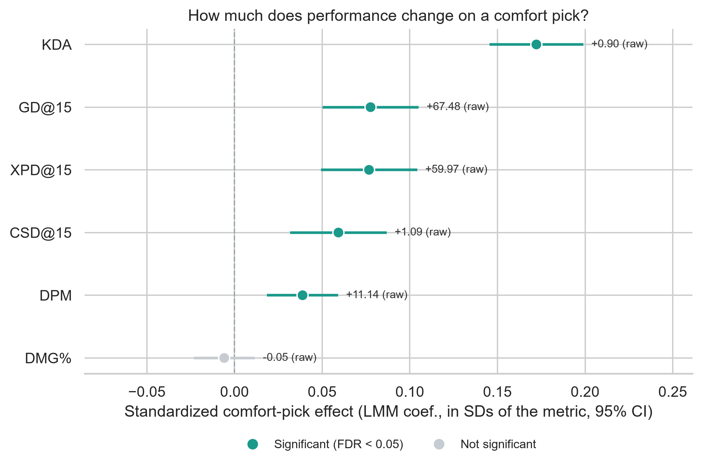
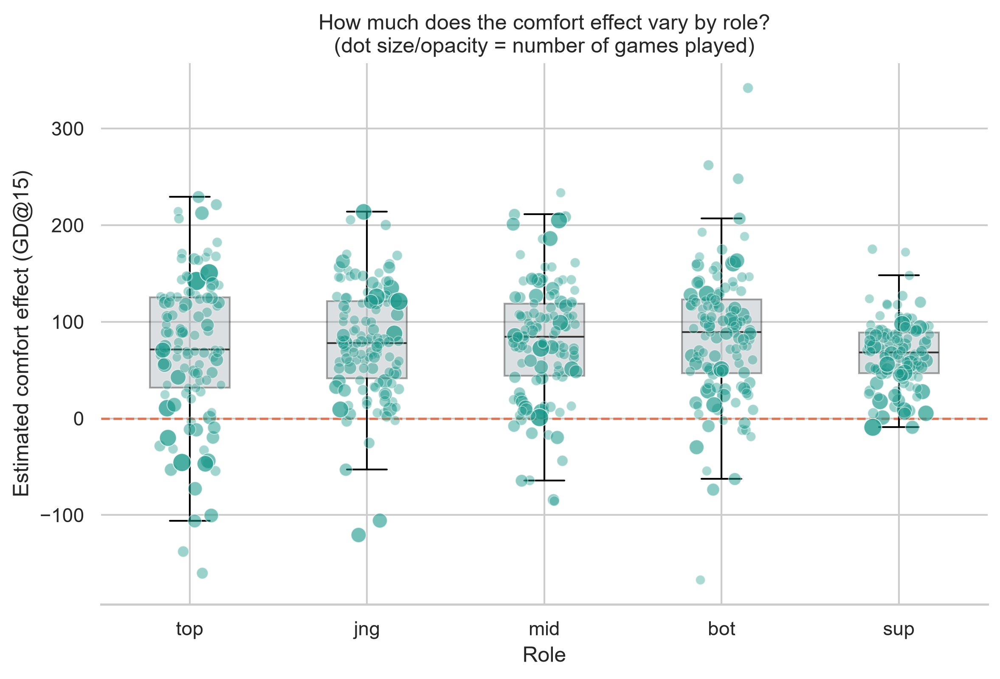
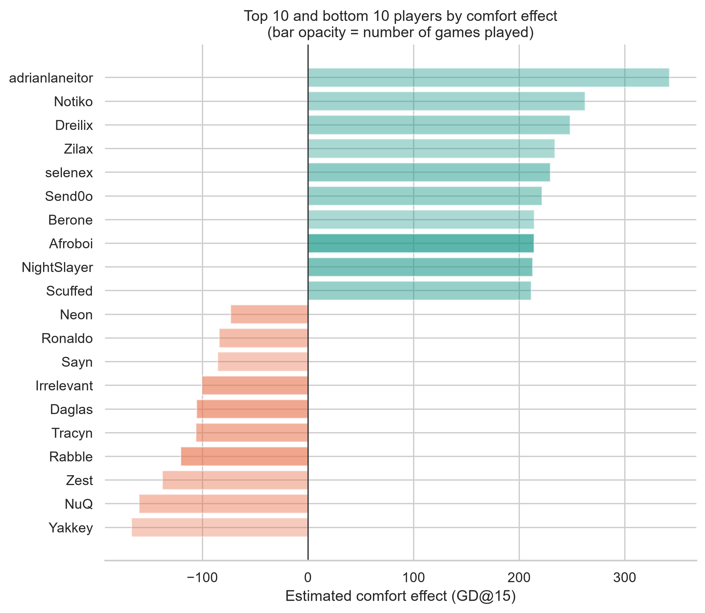
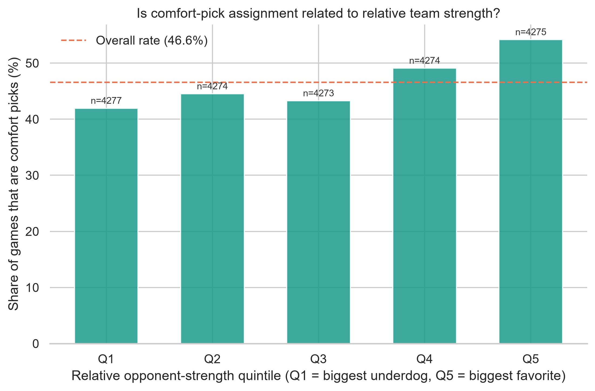

# Do comfort picks actually help? What the data says

**TL;DR:** Players perform measurably better on comfort picks for early-game gold and CS leads, but the effect is smaller and less consistent for late-game metrics like damage share and KDA.

This is the short version of a larger statistical analysis — the full methodology, code, and every caveat live in [`03_stats_analysis.ipynb`](./03_stats_analysis.ipynb). This page is for anyone who wants the headline in two minutes rather than the notebook.

## The question

When a pro player picks a champion they're deeply comfortable on, instead of one assigned by the draft or team composition, does it show up in their actual in-game performance — controlling for role, side, and how strong the opponent was that game?

Data: 28,194 player-games across 4 European Regional Leagues (LES, LFL, Prime League, NLC) and EMEA Masters, 2024–2026, sourced from [Oracle's Elixir](https://oracleselixir.com).

## What we found

Controlling for role, side, and relative opponent strength, comfort picks are associated with a **67.48-gold better lead at 15 minutes** on average (0.078-SD effect, 95% CI 0.050–0.105), and this holds up after correcting for testing six metrics at once. The effect on damage share (DMG%) was smaller and not statistically distinguishable from zero after FDR adjustment.

The positive intra-player shift is consistent across the league ($r_B = 0.243$, mean difference of +83.8 gold) rather than driven by a handful of superstar outliers. Most players systematically outperform their personal baseline in early gold differential when piloting a comfort pick.

### Does it matter more for some roles than others?

Top lane exhibits the widest spread in comfort returns ($\text{SD} = 76.8\text{g}$), followed closely by Bot ($\text{SD} = 67.9\text{g}$) and Mid ($\text{SD} = 61.4\text{g}$), where lane matchup familiarity creates large swings. In contrast, Support displays the narrowest distribution ($\text{SD} = 34.1\text{g}$), indicating comfort is far less influential for isolated resource leads in utility roles.

The gap between the players who benefit most and least from comfort picks is 509.1 gold at 15 minutes, confirming that comfort is not a universal buff across the board—it is heavily player-dependent.

## An important honesty check: is "comfort" actually assigned at random?

No — and this matters for how you read every number above. The logistic regression shows that relative team strength (`elo_diff_z`) significantly predicts whether a comfort pick is drafted ($p < 0.05$), with favored teams locking in comfort at higher rates. This means the numbers above are an **adjusted association**, not a proven causal effect: coaching staffs choose comfort picks for reasons that are themselves correlated with winning, and this analysis can't fully untangle that yet. See [Known limitations](./README.md#known-limitations) for what a stronger causal design would need.

## What this means for a coaching staff

- **Prioritize solo lanes in draft capital:** For early-game leads specifically, allocating draft priority to comfort picks yields the highest return in Top and Mid, where matchup volatility and lane mastery have the largest variance.
- **Make it a per-player evaluation, not a blanket rule:** With a 509.1-gold spread between the highest- and lowest-performing players on comfort, coaching staffs should quantify individual player comfort deltas instead of enforcing league-wide drafting heuristics.
- **Account for opponent strength during VOD review:** Because comfort picks are drafted disproportionately against weaker opponents, raw win rates overstate their true impact. Always contextualize off-comfort games against the caliber of the opponent faced.

## Want the full picture?

- [`03_stats_analysis.ipynb`](./03_stats_analysis.ipynb) — every test, model, and the selection-bias check in full, with the reasoning behind each modeling choice
- [`04_visuals.ipynb`](./04_visuals.ipynb) — how these five figures are built
- [`sql/`](./sql/README.md) — the same data as a queryable SQL layer
- [`README.md`](./README.md) — project overview, data scope, and known limitations

Questions, pushback, or "have you tried X" are genuinely welcome — angel.diaz.santiago.07@gmail.com .